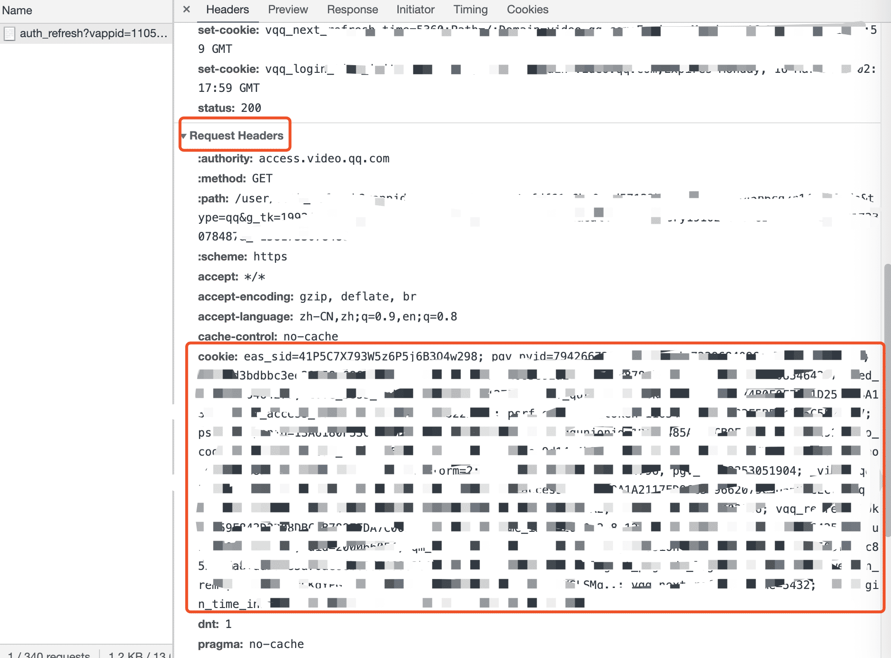
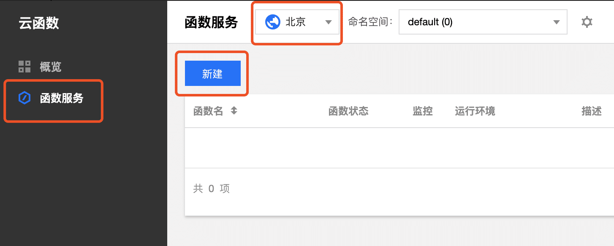
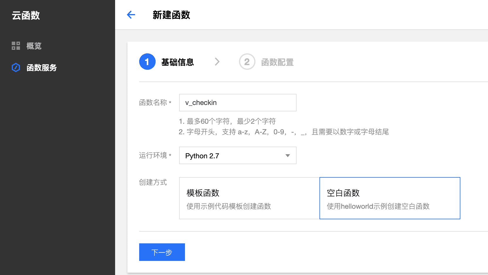
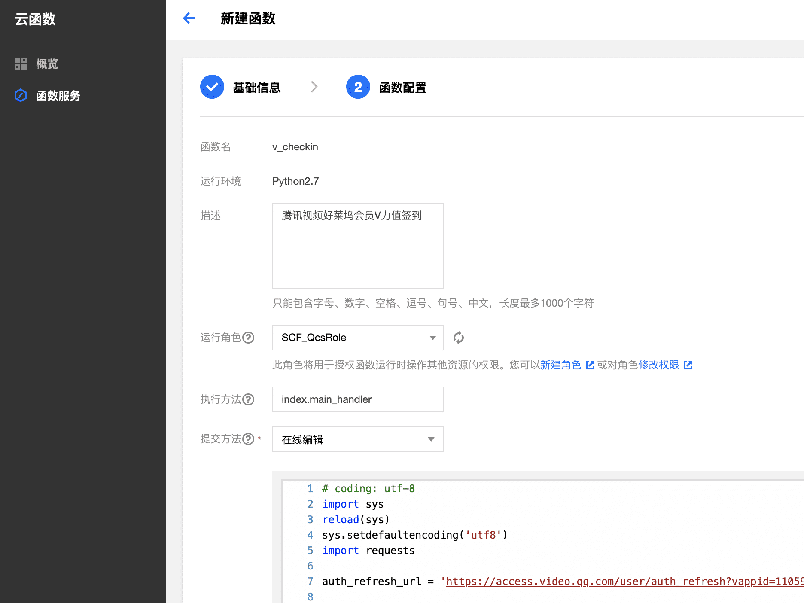
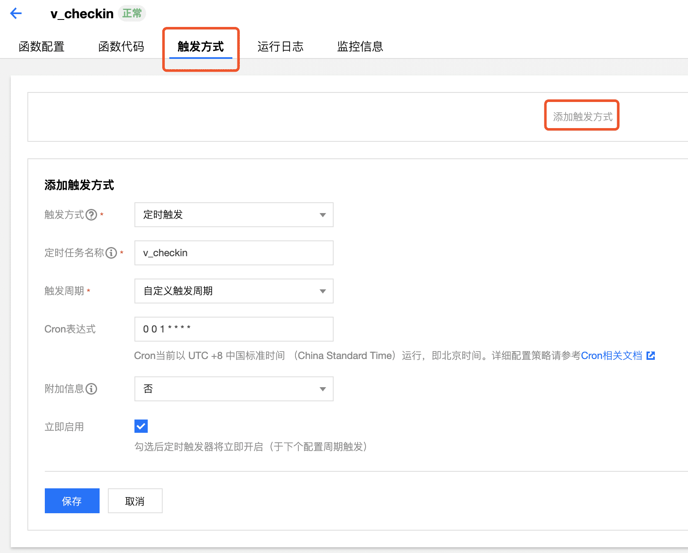

# QQVideoSign

🚀 腾讯视频好莱坞会员V力值签到。

代码由[sy-records](https://github.com/sy-records)的[v-checkin](https://github.com/sy-records/v-checkin/)改动而来，额外增加了4项任务的领取，需要手动完成任务才能领取。(通常我是观看60分钟会忘记领)

## 准备

* 注册[Server酱](http://sc.ftqq.com/)，获取`SCKEY`，修改脚本`index.py`中的`sckey`
> 用来通知微信提醒签到获得了多少V力值和**Cookie失效**，如果你不打算通知或者有其他方式，可以跳过

* 需要一台有`Python2`环境的`Linux`服务器或者使用[腾讯云Serverless](https://console.cloud.tencent.com/scf)
> 用来定时执行脚本

* 获取Cookie

1. 电脑打开浏览器访问`v.qq.com`，打开控制台(`F12`)、切换到Network，找到`https://access.video.qq.com/user/auth_refresh`的接口，把`Request URL:`后的地址都复制一下，填写到脚本的`auth_refresh_url`中，如：


```python
auth_refresh_url = 'https://access.video.qq.com/user/auth_refresh?vappid=11059694&vsecret=********&type=qq&g_tk=&g_vstk=********&g_actk=********&callback=jQuery191048649********_1575435********4&_=1575435********'
```

> 可以搜索`auth_refresh`进行过滤

2. 还是`auth_refresh`这个接口，复制`Request Header`中的`cookie`，填写到脚本的`login_headers`的`Cookie`中



```python
login_headers = {
    'Referer': 'https://v.qq.com',
    'Cookie': 'tvfe_boss_uuid=********; pgv_pvid=********; video_guid=***********; video_platform=2; pgv_info=ssid=***********; pgv_pvi=*************; pgv_si=*************; _qpsvr_localtk=***************; ptisp=; ptui_loginuin=************; RK=*************; ptcz=***************; main_login=qq; vqq_access_token=****************; vqq_appid=101483052; vqq_openid=********************; vqq_vuserid=*********************; vqq_vusession=dzsfo; vqq_refresh_token=*****************; uid=**************;'
}
```

3. 重复第二步，粘贴到脚本中的`sign_headers`的`Cookie`中，注意修改`vqq_vusession`，变量`cookie['vqq_vusession']`需要保留不要替换

```python
sign_headers = {
    'Cookie': 'tvfe_boss_uuid=***********; pgv_pvid=***************; video_guid=***************; video_platform=2; pgv_info=ssid=****************; pgv_pvi=****************; pgv_si=***************; _qpsvr_localtk=*************; ptisp=; ptui_loginuin=***************; RK=****************; ptcz=*********************; main_login=qq; vqq_access_token=************; vqq_appid=101483052; vqq_openid=*************; vqq_vuserid=*************; vqq_vusession=' + cookie['vqq_vusession'] + ';'
}
```

## 定时执行

### Linux服务器

使用`crontab`定时执行就可以了，以下表达式为每天凌晨1点执行一次

```shell
0 1 * * * python2 /home/www/v-checkin/start.py >/dev/null 2>&1
```

### 腾讯云Serverless

使用腾讯云云函数来执行，方便没有服务器的同学。首先需要创建函数服务，打开腾讯云[云函数 - 控制台](https://console.cloud.tencent.com/scf)

#### 编写函数

1. 单击左侧导航栏【函数服务】，进入“函数服务”页面。
2. 在页面上方选择一个地域，最好选择离你常用地区近点的，不至于导致账号异常。单击【新建】。如下图所示：



3. 在“新建函数”页面填写函数基础信息，单击【下一步】。如下图所示：



* 函数名称：可以自定义，比如为 `v_checkin`。
* 运行环境：选择 “Python 2.7”。
* 创建方式：选择 “空白函数”。

4. 填写描述，复制刚才修改好的脚本`index.py`内容到下面的代码框中，并单击【完成】。如下图所示：



函数创建完成后，自动进入创建成功函数的“函数配置”页面，可查看该云函数的函数配置信息。

如果填错了代码，可以在选择【函数代码】中修改，修改完成后记得点击保存；点击【测试】，运行代码，测试结果是成功的话就没有问题了。

#### 设置触发方式

1. 在已创建函数的详情页面，选择【触发方式】，并单击【添加触发方式】。如下图所示：



* 触发方式：选择 “定时触发”。
* 触发周期：选择 “自定义触发周期”。
* Cron表达式：自己填写，如`0 0 1 * * * *`，表示每天凌晨1点执行一次。Cron表达式不懂的可以参考[腾讯云文档](https://cloud.tencent.com/document/product/583/9708#cron-.E8.A1.A8.E8.BE.BE.E5.BC.8F)

2. 填写完成点击【保存】即可。

## License

MIT
